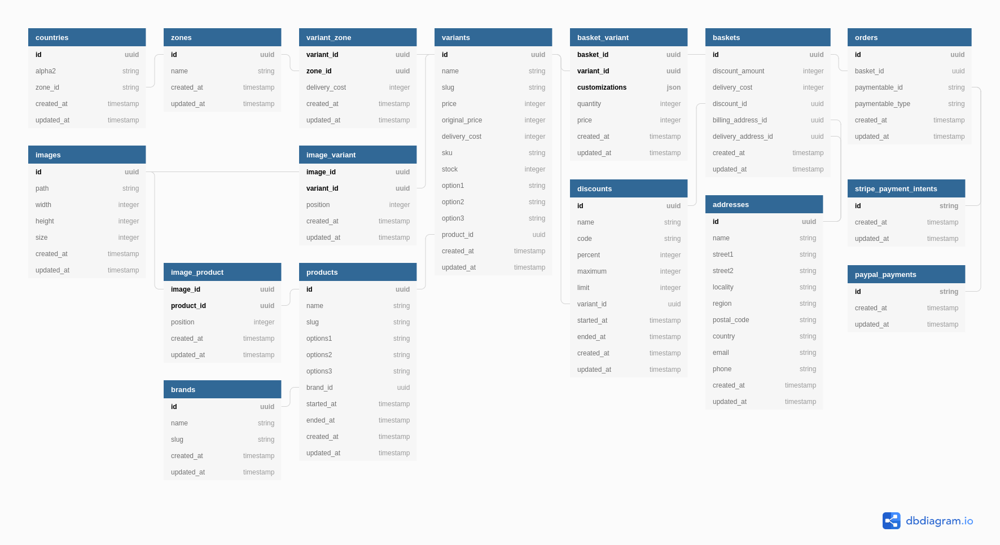

# laravel-shop (work in progress)


## Contents

- [Contents](#contents)
- [About](#about)
- [Database](#database)
    - [Entity-Relationship Diagram](#entity-relationship-diagram)
- [REST API](#rest-api)
    - [Address](#address)
        - [Create an address](#create-an-address)
        - [Retrieve an address](#retrieve-an-address)
        - [Update an address](#update-an-address)
        - [Delete an address](#delete-an-address)
    - [Basket](#basket)
        - [Create a basket](#create-an-basket)
        - [Retrieve a basket](#retrieve-an-basket)
        - [Update a basket](#update-an-basket)
        - [Delete a basket](#delete-an-basket)
    - [Brand](#brand)
        - [List all brands](#list-all-brands)
        - [Retrieve a brand](#retrieve-a-brand)
    - [Country](#country)
        - [List all countries](#list-all-countries)
        - [Retrieve a country](#retrieve-a-country)
    - [Discount](#discount)
        - [List all discounts](#list-all-discounts)
        - [Retrieve a discount](#retrieve-a-discount)
    - Image
    - Order
    - Product
    - [Variant](#variant)
        - [List all variants](#list-all-variants)
        - [Retrieve a variant](#retrieve-a-variant)
    - [Zone](#zone)
        - [List all zones](#list-all-zones)
        - [Retrieve a zone](#retrieve-a-zone)

## About

A package for Laravel based projects providing a shop web API.

## Database

### Entity-Relationship Diagram



## REST API

### Address

#### Create an address

```
POST /shop-api/addresses
{
    "name": "Lysanne Durgan",
    "street1": "86897 Ebony Park",
    "street2": "Suite 451",
    "locality": "South Antoniabury",
    "region": "South Carolina",
    "postal_code": "33547",
    "country": "US",
    "email": "lysanne.durgan@example.com",
    "phone": "1-594-781-8825"
}
```

```
201 Created
{
    "data": {
        "id": "5384d0d7-d372-42c2-8f41-8a0f6f3ee023",
        "name": "Lysanne Durgan",
        "street1": "86897 Ebony Park",
        "street2": "Suite 451",
        "locality": "South Antoniabury",
        "region": "South Carolina",
        "postal_code": "33547",
        "country": "US",
        "email": "lysanne.durgan@example.com",
        "phone": "1-594-781-8825",
        "created_at": "2019-02-01T03:45:27.612584Z",
        "updated_at": "2019-02-01T03:45:27.612584Z"
    }
}
```

#### Retrieve an address

```
GET /shop-api/addresses/5384d0d7-d372-42c2-8f41-8a0f6f3ee023
```

```
200 OK
{
    "data": {
        "id": "5384d0d7-d372-42c2-8f41-8a0f6f3ee023",
        "name": "Lysanne Durgan",
        "street1": "86897 Ebony Park",
        "street2": "Suite 451",
        "locality": "South Antoniabury",
        "region": "South Carolina",
        "postal_code": "33547",
        "country": "US",
        "email": "lysanne.durgan@example.com",
        "phone": "1-594-781-8825",
        "created_at": "2019-02-01T03:45:27.612584Z",
        "updated_at": "2019-02-01T03:45:27.612584Z"
    }
}
```

#### Update an address

```
PUT /shop-api/addresses/5384d0d7-d372-42c2-8f41-8a0f6f3ee023
{
    "name": "Elliot Moore",
    "street1": "0 Morgan Cove",
    "street2": "Flat 43",
    "locality": "South Johnshire",
    "region": "Peebleshire",
    "postal_code": "BL7 8BW",
    "country": "GB",
    "email": "elliot.moore@example.com",
    "phone": "08455 296005",
}
```

```
200 OK
{
    "data": {
        "id": "5384d0d7-d372-42c2-8f41-8a0f6f3ee023",
        "name": "Elliot Moore",
        "street1": "0 Morgan Cove",
        "street2": "Flat 43",
        "locality": "South Johnshire",
        "region": "Peebleshire",
        "postal_code": "BL7 8BW",
        "country": "GB",
        "email": "elliot.moore@example.com",
        "phone": "08455 296005",
        "created_at": "2019-02-01T03:45:27.612584Z",
        "updated_at": "2019-02-01T03:58:51.612584Z"
    }
}
```

#### Delete an address

```
DELETE /shop-api/addresses/5384d0d7-d372-42c2-8f41-8a0f6f3ee023
```

```
200 OK
{
    "data": {
        "id": "5384d0d7-d372-42c2-8f41-8a0f6f3ee023",
        "name": "Elliot Moore",
        "street1": "0 Morgan Cove",
        "street2": "Flat 43",
        "locality": "South Johnshire",
        "region": "Peebleshire",
        "postal_code": "BL7 8BW",
        "country": "GB",
        "email": "elliot.moore@example.com",
        "phone": "08455 296005",
        "created_at": "2019-02-01T03:45:27.612584Z",
        "updated_at": "2019-02-01T03:58:51.612584Z"
    }
}
```

### Basket

#### Create a basket

```
POST /shop-api/baskets
{
    "billing_address_id": null,
    "delivery_address_id": null
    "discount_id": null,
}
```

```
201 Created
{
    "data": {
        "id": "26a1123f-4565-495c-8da5-8286a608a037",
        "subtotal": 5235,
        "discount_amount": 0,
        "delivery_cost": 0,
        "total": 5235,
        "billing_address_id": null,
        "delivery_address_id": null
        "discount_id": null,
        "created_at": "2019-02-01T03:45:27.612584Z",
        "updated_at": "2019-02-01T03:45:27.612584Z"
    }
}
```

#### Retrieve a basket

```
GET /shop-api/baskets/26a1123f-4565-495c-8da5-8286a608a037
```

```
200 OK
{
    "data": {
        "id": "26a1123f-4565-495c-8da5-8286a608a037",
        "subtotal": 5235,
        "discount_amount": 0,
        "delivery_cost": 0,
        "total": 5235,
        "billing_address_id": null,
        "delivery_address_id": null
        "discount_id": null,
        "created_at": "2019-02-01T03:45:27.612584Z",
        "updated_at": "2019-02-01T03:45:27.612584Z"
    }
}
```

#### Update a basket

```
PUT /shop-api/baskets/26a1123f-4565-495c-8da5-8286a608a037
{
    "billing_address_id": "c82509df-f5f5-4665-ad1d-b70ed4675246",
    "delivery_address_id": "a16525ae-fd54-4e73-9704-f9872bdcb7c5"
    "discount_id": "voluptatem",
}
```

```
200 OK
{
    "data": {
        "id": "26a1123f-4565-495c-8da5-8286a608a037",
        "subtotal": 5235,
        "discount_amount": 500,
        "delivery_cost": 826,
        "total": 5561,
        "billing_address_id": "c82509df-f5f5-4665-ad1d-b70ed4675246",
        "delivery_address_id": "a16525ae-fd54-4e73-9704-f9872bdcb7c5"
        "discount_id": "voluptatem",
        "created_at": "2019-02-01T03:45:27.612584Z",
        "updated_at": "2019-02-01T03:58:51.612584Z"
    }
}
```

#### Delete a basket

```
DELETE /shop-api/baskets/26a1123f-4565-495c-8da5-8286a608a037
```

```
200 OK
{
    "data": {
        "id": "26a1123f-4565-495c-8da5-8286a608a037",
        "subtotal": 5235,
        "discount_amount": 500,
        "delivery_cost": 826,
        "total": 5561,
        "billing_address_id": "c82509df-f5f5-4665-ad1d-b70ed4675246",
        "delivery_address_id": "a16525ae-fd54-4e73-9704-f9872bdcb7c5"
        "discount_id": "voluptatem",
        "created_at": "2019-02-01T03:45:27.612584Z",
        "updated_at": "2019-02-01T03:58:51.612584Z"
    }
}
```

### Brand

#### List all brands

```
GET /shop-api/brands
```

```
200 OK
{
    "data": [
        {
            "id": "b1b9e662-c2fe-45fa-9070-612d7d62e9cc",
            "name": "Hills-Johns",
            "slug": "hills-johns",
            "created_at": "2019-02-01T03:45:27.612584Z",
            "updated_at": "2019-02-01T03:45:27.612584Z"
        },
        {
            "id": "3af6486e-81c2-4b34-9292-ad8ba1efb2e8",
            "name": "Powlowski, Beahan and Langworth",
            "slug": "powlowski-beahan-and-langworth",
            "created_at": "2019-02-01T03:45:27.612584Z",
            "updated_at": "2019-02-01T03:45:27.612584Z"
        },
        ...
    ]
}
```

#### Retrieve a brand

```
GET /shop-api/brands/3af6486e-81c2-4b34-9292-ad8ba1efb2e8
```

```
200 OK
{
    "data": {
        "id": "3af6486e-81c2-4b34-9292-ad8ba1efb2e8",
        "name": "Powlowski, Beahan and Langworth",
        "slug": "powlowski-beahan-and-langworth",
        "created_at": "2019-02-01T03:45:27.612584Z",
        "updated_at": "2019-02-01T03:45:27.612584Z"
    }
}
```

### Country

#### List all countries

```
GET /shop-api/countries
```

```
200 OK
{
    "data": [
        {
            "id": "a39aa166-a8e6-479c-a39f-81f78a303edb",
            "alpha2": "CA",
            "zone_id": "0be01f9d-60fc-41e8-8649-5fb3957345bf",
            "created_at": "2019-02-01T03:45:27.612584Z",
            "updated_at": "2019-02-01T03:45:27.612584Z"
        },
        {
            "id": "46d5ea86-0e59-4504-97c3-fd35de0bd6d1",
            "alpha2": "GB",
            "zone_id": "247a3a81-251c-4258-805f-09246c8270f2",
            "created_at": "2019-02-01T03:45:27.612584Z",
            "updated_at": "2019-02-01T03:45:27.612584Z"
        },
        ...
    ]
}
```

#### Retrieve a country

```
GET /shop-api/countries/46d5ea86-0e59-4504-97c3-fd35de0bd6d1
```

```
200 OK
{
    "data": {
        "id": "46d5ea86-0e59-4504-97c3-fd35de0bd6d1",
        "alpha2": "GB",
        "zone_id": "247a3a81-251c-4258-805f-09246c8270f2",
        "created_at": "2019-02-01T03:45:27.612584Z",
        "updated_at": "2019-02-01T03:45:27.612584Z"
    }
}
```

### Discount

#### List all discounts

```
GET /shop-api/discounts?code=FEB20
```

```
200 OK
{
    "data": [
        {
            "id": "f0ada142-969d-4c66-8c9c-21bf3fd27fea",
            "name": "20% off your order (maximum £15)",
            "code": "FEB20",
            "percent": 20,
            "maximum": 1500,
            "limit": 10000,
            "variant_id": null,
            "started_at": "2019-02-04T00:00:00Z",
            "ended_at": "2019-02-10T23:59:59Z",
            "created_at": "2019-02-01T03:45:27.612584Z",
            "updated_at": "2019-02-01T03:45:27.612584Z"
        }
    ]
}
```

#### Retrieve a discount

```
GET /shop-api/discounts/f0ada142-969d-4c66-8c9c-21bf3fd27fea
```

```
200 OK
{
    "data": {
        "id": "f0ada142-969d-4c66-8c9c-21bf3fd27fea",
        "name": "20% off your order (maximum £15)",
        "code": "FEB20",
        "percent": 20,
        "maximum": 1500,
        "limit": 10000,
        "variant_id": null,
        "started_at": "2019-02-04T00:00:00Z",
        "ended_at": "2019-02-10T23:59:59Z",
        "created_at": "2019-02-01T03:45:27.612584Z",
        "updated_at": "2019-02-01T03:45:27.612584Z"
    }
}
```

### Variant

#### List all variants

```
GET /shop-api/variants
```

```
200 OK
{
    "data": [
        {
            "id": "3b919a4a-0e65-4e31-a18c-6101b75e40a5",
            "name": "...",
            "slug": "...",
            "price": "...",
            "original_price": "...",
            "delivery_cost": "...",
            "sku": "...",
            "stock": "...",
            "option1": "...",
            "option2": "...",
            "option3": "...",
            "product_id": "20128169-eb74-4b09-ad93-a3365dc1edfe",
            "created_at": "2019-02-01T03:45:27.612584Z",
            "updated_at": "2019-02-01T03:45:27.612584Z"
        },
        {
            "id": "042ed433-9ddb-4e34-b190-2586e3f4eca2",
            "name": "...",
            "slug": "...",
            "price": "...",
            "original_price": "...",
            "delivery_cost": "...",
            "sku": "...",
            "stock": "...",
            "option1": "...",
            "option2": "...",
            "option3": "...",
            "product_id": "ec347505-bf7c-40cd-a251-150235101bfa",
            "created_at": "2019-02-01T03:45:27.612584Z",
            "updated_at": "2019-02-01T03:45:27.612584Z"
        },
        ...
    ],
    "links": {
        "first": "https://example.com/shop-api/variants?page=1",
        "last": "https://example.com/shop-api/variants?page=1",
        "next": null,
        "prev": null
    },
    "meta": {
        "current_page": 1,
        "from": 1,
        "last_page": 1,
        "path": "https://example.com/shop-api/variants",
        "per_page": 24,
        "to": 10,
        "total": 10
    }
}
```

#### Retrieve a variant

```
GET /shop-api/variants/042ed433-9ddb-4e34-b190-2586e3f4eca2
```

```
200 OK
{
    "data": {
        "id": "042ed433-9ddb-4e34-b190-2586e3f4eca2",
        "name": "...",
        "slug": "...",
        "price": "...",
        "original_price": "...",
        "delivery_cost": "...",
        "sku": "...",
        "stock": "...",
        "option1": "...",
        "option2": "...",
        "option3": "...",
        "product_id": "ec347505-bf7c-40cd-a251-150235101bfa",
        "created_at": "2019-02-01T03:45:27.612584Z",
        "updated_at": "2019-02-01T03:45:27.612584Z"
    }
}
```

### Zone

#### List all zones

```
GET /shop-api/zones
```

```
200 OK
{
    "data": [
        {
            "id": "b3c9538d-fae9-4c35-ba8a-d3e448b13724",
            "name": "Europe",
            "created_at": "2019-02-01T03:45:27.612584Z",
            "updated_at": "2019-02-01T03:45:27.612584Z"
        },
        {
            "id": "de6d8e01-ec98-42cb-8aa8-b924c953c894",
            "name": "North America",
            "created_at": "2019-02-01T03:45:27.612584Z",
            "updated_at": "2019-02-01T03:45:27.612584Z"
        },
        ...
    ]
}
```

#### Retrieve a zone

```
GET /shop-api/zones/b3c9538d-fae9-4c35-ba8a-d3e448b13724
```

```
200 OK
{
    "data": {
        "id": "b3c9538d-fae9-4c35-ba8a-d3e448b13724",
        "name": "Europe",
        "created_at": "2019-02-01T03:45:27.612584Z",
        "updated_at": "2019-02-01T03:45:27.612584Z"
    }
}
```
